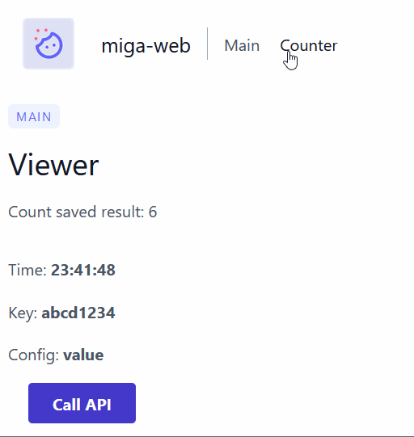

# Miga Web

[](https://choosealicense.com/licenses/apache-2.0/)
[](https://app.netlify.com/sites/wondrous-starship-d64a29/deploys)

Template to quickly setup a base-code with React and a set of common functionalities



## Features

* ⚡ Ready to use - [use this repository as template](https://github.com/JuanSierra/miga-web/generate) or use _gh CLI_  
* 📦 State management - easy and powerful React state management with [Teaful](https://github.com/teafuljs/teaful#usestore-hook)  
* 📍 SPA Routing - navigation setup ready to work with components-views structure  
* 💾 Local storage - custom hook to store data in browser [see](https://github.com/JuanSierra/miga-web/blob/master/src/hooks/useLocalStorage.js)  
* 🔒 Load secrets - use Vite environment variables to load API keys or other secrets  
* 🌐 API Request - vanilla fetch example to handle API request  
* 📄 Configuration variables - load configuration data from JSON  

## Demo

[Basic Template](https://wondrous-starship-d64a29.netlify.app/)

## Installation

Using gh CLI

```bash
  gh repo create --template JuanSierra/miga-web
```

## Usage

Start local
```bash
  npm start
```

Build production version -> /dist
```bash
  npm run build
```

Check site in http://localhost:3000

## Tech Stack

React, Teaful, TailwindCSS, Vite
